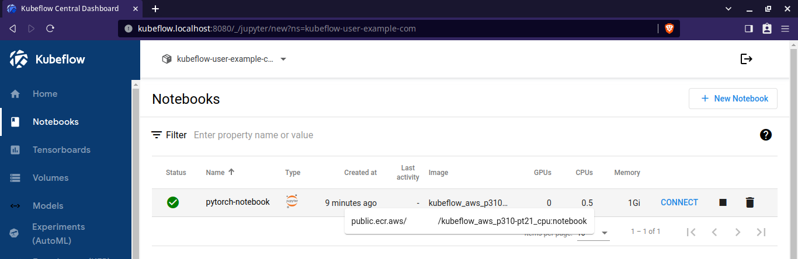
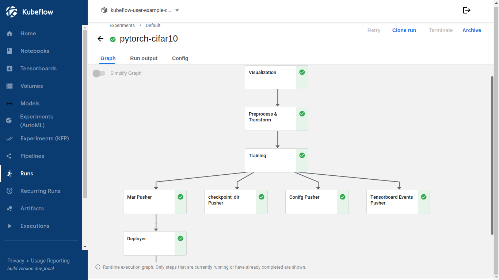
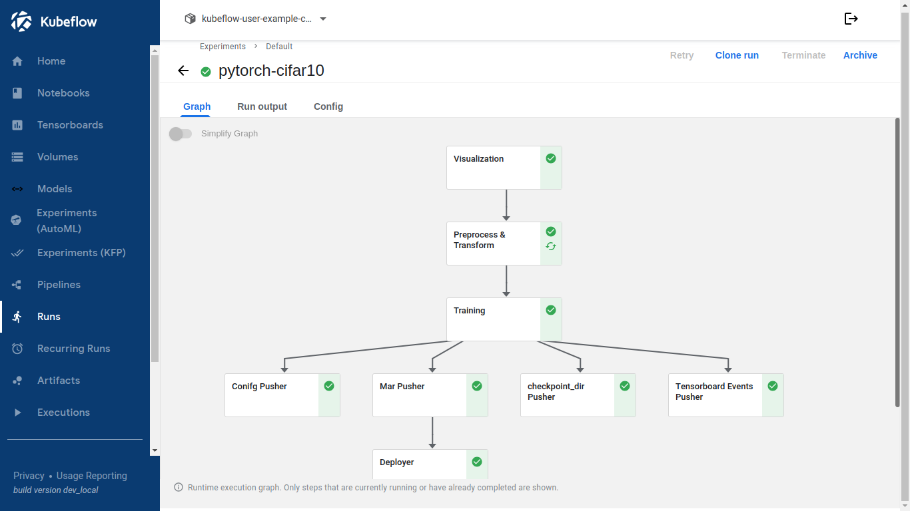
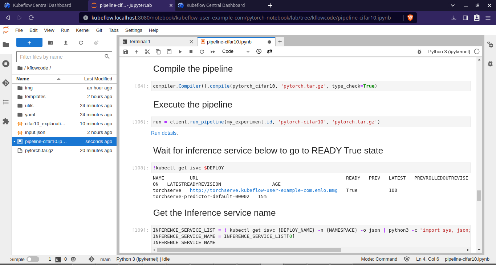

<div align="center">

# Kubeflow Pipelines on EKS

</div>

# Overview
In this repository, we deploy a pipeline in Kubeflow provisioned inside EKS. All steps in the pipeline are executed in custom Docker images. The model is trained on CPU and deployed using KServe. 

# Create Docker Images

Custom Docker images are built for each of the steps. The images are then pushed to ECR.

To see all the steps and the code, see the [steps here](./build_docker.md).

# Setup

All of these steps are mentioned in the [setup guide](./setup.md).

# Access Kubeflow UI
Once all the components are up and running, access the UI.

```bash
kubectl port-forward svc/istio-ingressgateway -n istio-system 8080:80
```

And browse to kubeflow.localhost:8080

email : user@example.com
password : 12341234


# Notebook
Use the image created in step 1 for the notebook.


# Pipeline
Inside the notebook, start the notebook. Don't forget to add the authentication token from Brave's Developer Tools.




# Subsequent Runs

Upon running the completed pipeline ,we see that the `processing` components is reused and taken from the cache.



Also, the model gets a new revision number.




# Demo

[](https://www.youtube.com/embed/NyEdL8Udb6w)


